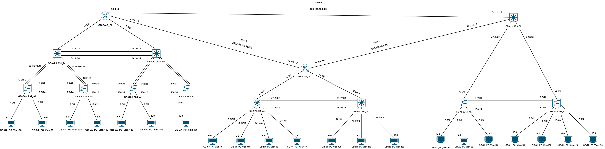
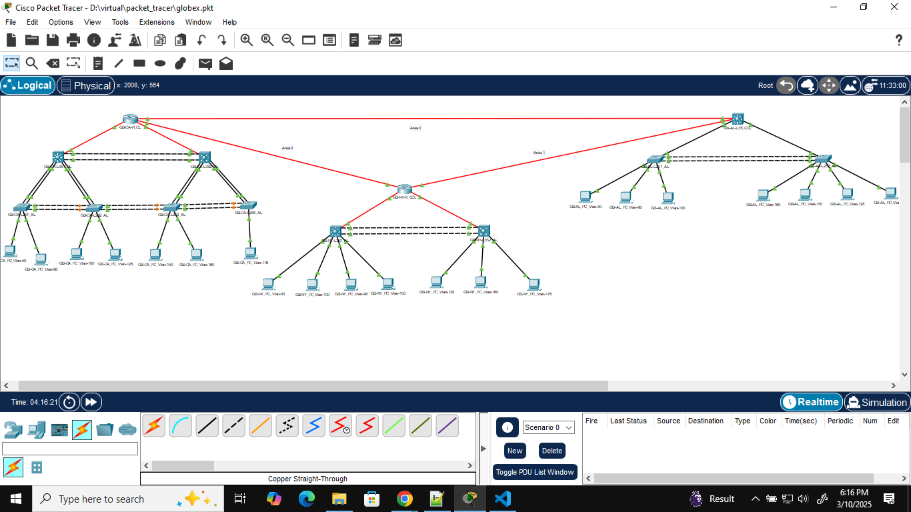

# Globex Network Infrastucture Project

This is a network infrasture enchancement project.

---

## 📖 Table of Contents

- [👋 Introdution](#introduction)
- [🗺️ Logical Topology](#logical-topology)
- [📁 Project Structure](#project-structure)
- [🛠 Tech Stack](#tech-stack)
- [🚀 Installation](#installation)
- [💻 Useage](#useage)
- [⚖️ License](#license)
- [🧑‍💻 Author](#author)

---

## Introduction

Globex is a multinational retail corporation which sells goods to many customers all around the globe and braches of Globex are located all around the globe. Recently there has been a scale up of customers at Alabama, California and Newyork states. In order to meet the demands of the growing customers of the corresponding states, current network infratructure was not sufficent. So the CTO of Globex decided to scale up the network infrastucture of the Alabama, California and Newyork braches. Alabama, California and Newyork folders contains network device configurations that belongs to the network equipment of those branches and the list of networking gears of those sites.

---

## Logical Topology

### Logical Topology



### Logical Topology in Packet Tracer



---

## Project Structure

```

globex/
|-->alabama/
|   |-->configuartions/
|   |-->devices/
|-->california/
|   |-->configuartions/
|   |-->devices/
|-->newyork/
|   |-->configuartions/
|   |-->devices/
|-->logical_topology_demo.png
|-->logical_toplogy.png

```

---

## Tech Stack

- **Vendor:** Cisco
- **Tools:** Cisco Packet Tracer

---

## Installation

- **Download Cisco Packet Tracer.exe file from Cisco Networking Academy.**
- **Run the exe file and complete complete the installlation process.**

---

## Useage

- **Login into the cisco packet tracer as a guest.**
- **According to the logical toplogy, create the network toplogy.**
- **Copy the relevant configuartion for devices from each state folder.**
- **Add the copied configurations to devices and save the configurations.**
- **After saving the configurations of all devices, perform connectivity tests, traceroute tests etc.**

---

## Author

Kavinda Kethiya Rajapaksha

- GitHub: your-username
- LinkedIn: your-linkedin
- Email: your.email@example.com


